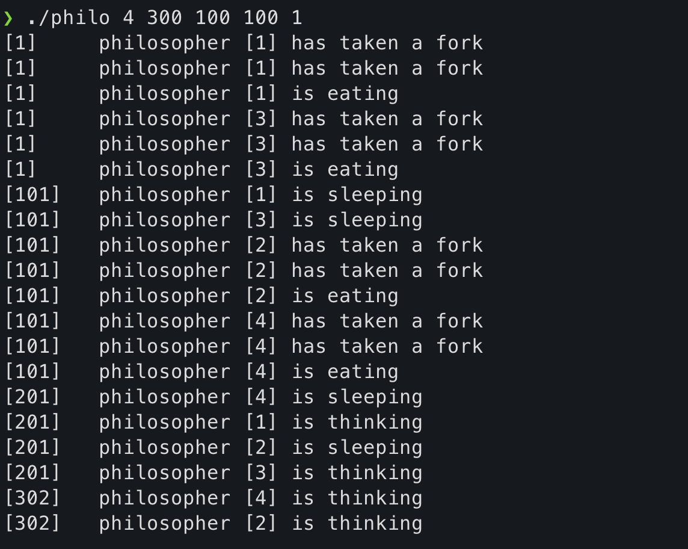

<h1 align="center">Philosophers</h1>

#### In this project, you will learn the principles of threading a process and how to make threads. Also you will discover the mutex. 

## 📚 Mandatory Part 📚

- **Name of the program** : `philo`
- **Files** : [`*.c`](./src) [`philo.h`](./includes/philo.h) [`Makefile`](./Makefile)
- **Makefile rules** : `all` `clean` `fclean` `re`
- **Arguments** : `number_of_philosophers` `time_to_die time_to_eat` `time_to_sleep` `number_of_times_each_philosopher_must_eat`
- **Authorized functions** : [`memset`](https://www.tutorialspoint.com/c_standard_library/c_function_memset.htm) [`printf`](https://en.wikipedia.org/wiki/Printf_format_string) [`malloc`](https://man7.org/linux/man-pages/man3/free.3.html) [`free`](https://man7.org/linux/man-pages/man3/free.3.html) [`write`](https://man7.org/linux/man-pages/man2/write.2.html) [`close`](https://linux.die.net/man/2/close) [`usleep`](https://man7.org/linux/man-pages/man3/usleep.3.html) [`gettimeofday`](https://man7.org/linux/man-pages/man2/settimeofday.2.html) [`pthread_create`](https://man7.org/linux/man-pages/man3/pthread_create.3.html) [`pthread_detach`](https://man7.org/linux/man-pages/man3/pthread_detach.3.html) [`pthread_join`](https://man7.org/linux/man-pages/man3/pthread_join.3.html) [`pthread_mutex_init`](https://man7.org/linux/man-pages/man3/pthread_mutex_init.3p.html) [`pthread_mutex_destroy`](https://man7.org/linux/man-pages/man3/pthread_mutex_destroy.3p.html) [`pthread_mutex_lock`](https://man7.org/linux/man-pages/man3/pthread_mutex_lock.3p.html) [`pthread_mutex_unlock`](https://man7.org/linux/man-pages/man3/pthread_mutex_lock.3p.html)
- Every philosopher should be a thread.
- A fork beetwen every philosopher. So if there are multimple philsophers there shoud be a fork to the right and left of each other.
- To prevent multiple philosophers from using the same fork, you must protect the state each with its own mutex.

## General Instructions

- One or more philosophers sit around a round table and they have to eat, sleep and think, not at the same time. In the center of the table here is a big bowl of spaghetti.
- There are some forks in the table, one beetween each two philosophers. There are the same `number_of_philosophers` as forks. 
- Philosophers need two forks to eat. And they take `time_to_eat` ms to eat.
- All philosophers should eat `time_to_die` ms before their last meal. If they dont eat in that time, they die.
- They also take `time_to_sleep` ms to sleep.
- If `number_of_times_each_philosopher_must_eat` is specified when all the philosophers eat that much the program should stop. If not, the program only should stop if someone die.
- Every action of a philosopher X should be printed like this:

⠀⠀⠀⠀⠀⠀⠀⠀-> `timestamp_in_ms X has taken a fork`

⠀⠀⠀⠀⠀⠀⠀⠀-> `timestamp_in_ms X is eating`

⠀⠀⠀⠀⠀⠀⠀⠀-> `timestamp_in_ms X is sleeping`

⠀⠀⠀⠀⠀⠀⠀⠀-> `timestamp_in_ms X is thinking`

⠀⠀⠀⠀⠀⠀⠀⠀-> `timestamp_in_ms X died`

- It cannot take 10ms beetween the death of a philosopher and the printing of it's death.

## 💣 EXAMPLES 💣

### First example where we have only one philosopher. This philosopher died in de ms 801 because he didn't eat in that time, the reason is because he only had 1 fork and he needed 2.

  

### In the second example, we have 4 philosophers that should eat 300ms before they last meal, they take 100ms to eat and 100ms to sleep, and they all have to eat one time. We can se that before they all eat, the prgram ends.

  

## 💯 Mark 💯

  

